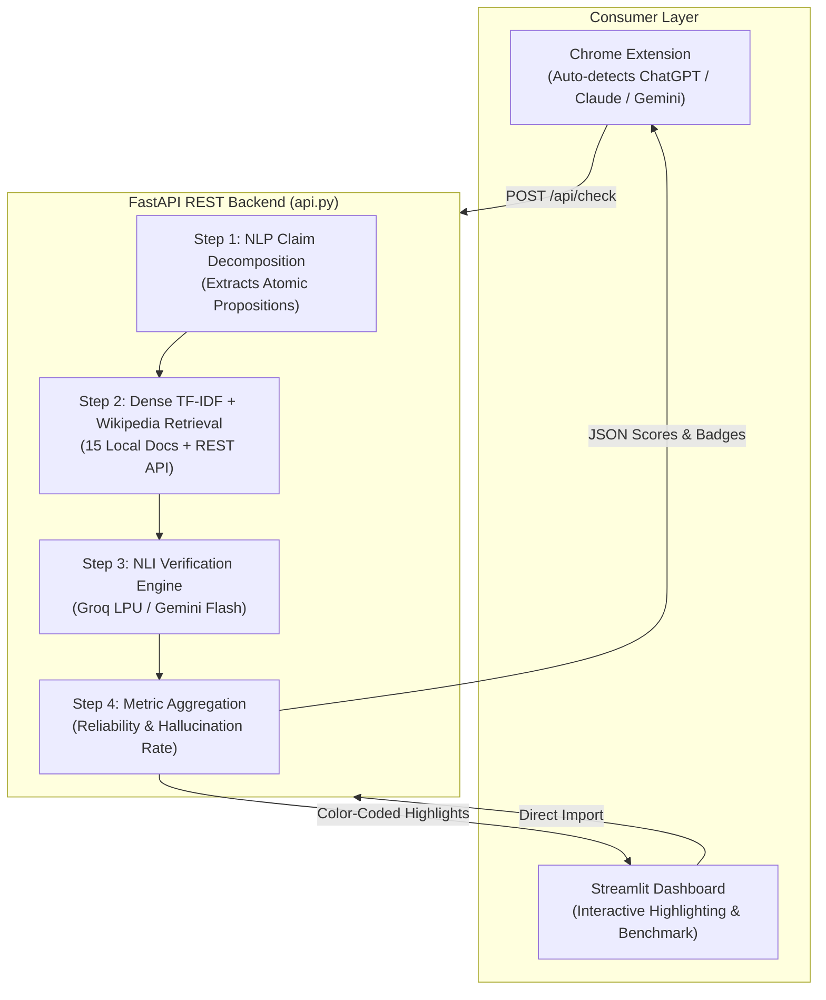

# 🛡️ VeritasAI: AI Hallucination & Factuality Detector

[](#-chrome-extension-setup)
[](https://fastapi.tiangolo.com/)
[](https://groq.com/)
[](https://streamlit.io/)
[](https://python.org)
[](LICENSE)

An enterprise-grade, retrieval-augmented factuality verification copilot that detects hallucinations in AI-generated answers in real time. Deconstructs responses into atomic factual propositions, retrieves evidence from an encyclopedic vector knowledge base + real-time Wikipedia search, and evaluates claims with Natural Language Inference (NLI).

Available both as a **Chrome Browser Extension** (with auto-detection for **ChatGPT**, **Claude**, and **Gemini**) and an **Academic Streamlit Research Dashboard** with an automated Confusion Matrix benchmark.

---

## 🌟 What Makes VeritasAI Unique?

### 1. 🧩 Universal Chrome Extension with 3-LLM Auto-Detection
Lives directly inside your browser. When you open an AI interface, the extension automatically configures itself:
* 🟢 **ChatGPT (`chatgpt.com`):** Detects OpenAI chat sessions and hooks into assistant message bubbles.
* 🟠 **Claude (`claude.ai`):** Identifies Anthropic Claude conversation turns.
* 🔵 **Gemini (`gemini.google.com`):** Auto-adapts to Google Gemini response containers.
* ✨ **"Grab Latest" Button:** One-click DOM scraper extracts the assistant's latest response or highlighted text directly without copy-pasting.
* 🛡️ **Instant In-Popup Audit:** Renders Reliability Score, Hallucination Risk %, and claim-by-claim citations in under ~1 second.

### 2. ⚡ Blazing-Fast Groq LPU & Multi-Provider Engine
Powered by Groq's Language Processing Units (LPU) for **sub-second NLI inference** (~0.4s latency):
* **Groq LPU:** `openai/gpt-oss-120b` & `llama-3.3-70b-versatile` (Default, ultra-fast)
* **Google Gemini:** `gemini-flash-lite-latest` & `gemini-2.5-flash`
* **OpenAI:** `gpt-4o-mini`
* **xAI Grok:** `grok-2-latest`
* **Local Semantic Fallback:** Pure heuristic NLI fallback if offline.

### 3. 📚 Deep Curated Knowledge Base (15 Domains, 140 Chunks)
Indexes locally in **0.05 seconds** using Scikit-Learn sublinear TF-IDF + NumPy Cosine Similarity:
* **Deep AI/ML:** Transformers (MHA, RoPE, RMSNorm), Optimizers (AdamW, Adafactor), SFT, RLHF, DPO, LoRA/QLoRA.
* **Advanced Algorithms:** Master Theorem, Red-Black Trees, B+ Trees, Bloom Filters, Dijkstra, A*, Tarjan SCC, Segment Trees.
* **Databases & Systems:** Database Sharding, ACID, MVCC, B-Tree indexing, Horizontal Partitioning, CAP theorem.
* **Cloud & DevOps:** Docker container namespaces/cgroups vs VMs, Kubernetes Pods, Serverless/FaaS.
* **Cybersecurity:** CIA Triad, AES-GCM, RSA vs ECC, OWASP Top 10 (SQLi, XSS, CSRF).
* **Tech History:** Founding facts, years, and leadership for Google, Apple, Microsoft, Amazon, Meta, and OpenAI.
* **Core Languages & OS:** Python, C, Java, JavaScript, Linux Kernel, Computer Networking, Git VCS, Memory Architecture.

### 4. 📊 Academic ML Benchmark Suite (90.0% Accuracy, 88.9% F1)
Rigorous evaluation on **30 standardized ground-truth test pairs** across systems programming and algorithms:

| Metric | Score | Scientific Significance |
|:---|:---|:---|
| **Accuracy** | **90.0%** | Overall correct classification rate |
| **Precision** | **100.0%** | **0 False Positives** (no valid fact falsely labeled as hallucinated) |
| **Recall / Sensitivity** | **80.0%** | 12 out of 15 subtle hallucinations successfully trapped |
| **F1-Score** | **88.9%** | Harmonic balance between Precision and Recall |
| **Confusion Matrix** | **TP: 12, TN: 15, FP: 0, FN: 3** | Exact 2x2 contingency matrix |

---

## 🏗️ Architecture & Dataflow



---

## 🔬 Mathematical Formulations

### 1. Confidence-Weighted Reliability Score
```math
\text{Reliability} = \left( \frac{\sum_{i=1}^N w_i \cdot c_i}{\sum_{i=1}^N c_i} \right) \times 100
```
Where $c_i \in [0, 1]$ is the NLI confidence score, and weights $w_i$ are assigned as:
* **`SUPPORTED`** ($w = 1.0$): Entailment; factually verified.
* **`INSUFFICIENT_EVIDENCE`** ($w = 0.4$): Epistemic uncertainty (unpenalized missing context).
* **`CONTRADICTED`** ($w = 0.0$): Factual contradiction / AI Hallucination.

### 2. Hallucination Rate (HR)
```math
\text{Hallucination Rate} = \left( \frac{N_{\text{Contradicted}}}{N_{\text{Total Claims}}} \right) \times 100
```

---

## 📁 Repository Structure

```
ai-hallucination-detector/
├── extension/                 # Chrome Browser Extension (Manifest V3)
│   ├── manifest.json          # Extension metadata & domain permissions
│   ├── popup.html             # Glassmorphism popup user interface
│   ├── popup.css              # Dark-mode responsive styling
│   ├── popup.js               # Auto-detection & API fetch controller
│   ├── content.js             # ChatGPT / Claude / Gemini DOM message extractor
│   └── icon*.png              # Extension icons (16, 48, 128)
├── api.py                     # High-performance FastAPI REST server (CORS-enabled)
├── app.py                     # Streamlit research portal (Visual highlighter & Viva guide)
├── claim_extractor.py         # NLP atomic proposition extractor
├── retriever.py               # Scikit-Learn TF-IDF VectorIndex + Wikipedia REST retriever
├── evaluator.py               # NLI verification & fine-grained hallucination taxonomy
├── scorer.py                  # Reliability scoring & risk classification formulas
├── benchmark.py               # Academic Confusion Matrix benchmark suite
├── llm_provider.py            # Multi-provider abstraction (Groq, Gemini, OpenAI, Grok)
├── knowledge_base/            # 15 technical knowledge base documents (140 chunks)
├── Run_Veritas_Silent.vbs     # 1-click silent background launcher for Windows (zero terminal)
├── Stop_Veritas.bat           # 1-click background stopper for Windows
├── render.yaml                # Render Blueprint for 24/7 cloud deployment
└── requirements.txt           # Pinned production dependencies
```

---

## 🚀 Installation & Usage

### 1. Clone & Install Dependencies
```bash
git clone https://github.com/sushant-1212/ai-hallucination-detector.git
cd ai-hallucination-detector
pip install -r requirements.txt
```

### 2. Configure Environment Variables
Create a `.env` file in the root directory:
```env
LLM_PROVIDER=groq
GROQ_API_KEY=your_groq_api_key_here
GROQ_MODEL=openai/gpt-oss-120b

# Optional fallbacks
GOOGLE_API_KEY=your_gemini_api_key_here
```

---

### 🧩 Chrome Extension Setup (Takes 15 Seconds)

1. Open **Google Chrome** (or Edge / Brave) and navigate to:
   ```text
   chrome://extensions
   ```
2. Enable **Developer mode** (toggle in the top-right corner).
3. Click **Load unpacked** (top-left) and select the `extension` folder inside this repository:
   ```text
   C:\path\to\ai-hallucination-detector\extension
   ```
4. Click the puzzle icon in Chrome and **Pin** VeritasAI.

---

### 💻 Running the Services

#### Mode A: Run the FastAPI Backend (for the Extension)
```bash
python api.py
```
*API runs at `http://127.0.0.1:8000` with Swagger documentation at `http://127.0.0.1:8000/docs`.*

*(Windows users: You can also simply double-click `Run_Veritas_Silent.vbs` to run it invisibly in the background with **no terminal window**!)*

#### Mode B: Run the Streamlit Research Dashboard
```bash
streamlit run app.py
```
*Access the interactive visual dashboard and benchmark suite at `http://localhost:8501`.*

#### Mode C: Cloud Deployment on Render (24/7 Zero-Terminal Hosting)
1. Fork or push this repository to GitHub.
2. In [Render Dashboard](https://dashboard.render.com/), click **New + $\rightarrow$ Web Service**.
3. Select this repo with Start Command:
   ```bash
   uvicorn api:app --host 0.0.0.0 --port $PORT
   ```
4. Add your `GROQ_API_KEY` and `LLM_PROVIDER=groq` in the Environment tab.
5. In the extension popup, select your Render URL from the server dropdown for 24/7 cloud verification!

---

## 🧪 Running Automated Unit & Pipeline Tests

```bash
python test_pipeline.py
```

---

## 📄 License
This project is open-source under the [MIT License](LICENSE).
